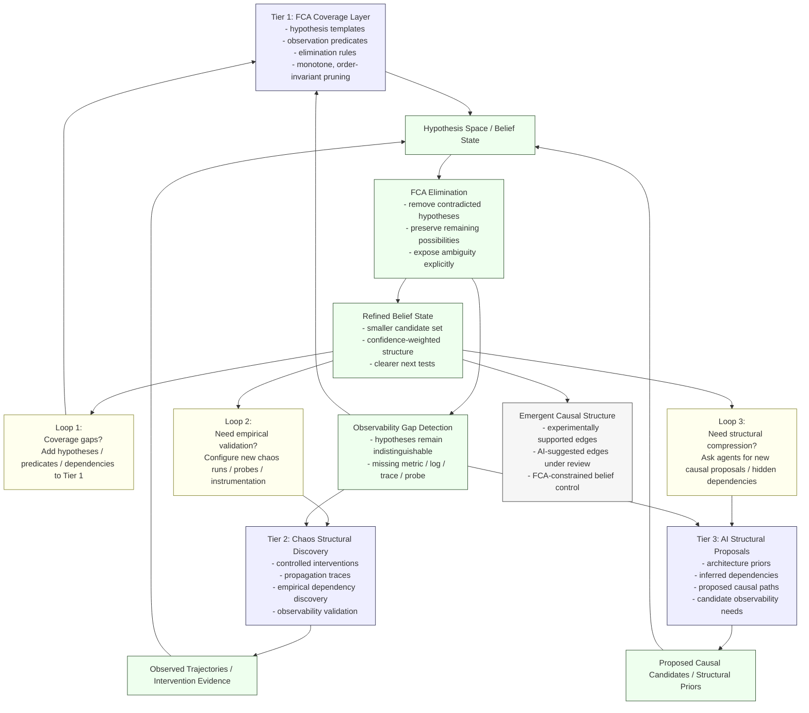

# FCA–Causal Hybrid Architecture for Hypothesis Discovery

## Overview

This document clarifies the architectural trade-offs between **Formal Concept Analysis (FCA) / meet-semilattice elimination** and **causal graph modeling**, and describes a practical hybrid approach for systems where:

* a causal model cannot be hand-crafted in advance
* domain expertise is incomplete
* the system must remain **correct under uncertainty**

The architecture described here uses **FCA as the correctness anchor**, while **chaos experiments** and **AI agents** progressively discover causal structure.

This approach allows the system to maintain **coverage guarantees** while gradually distilling the hypothesis space into an efficient causal representation.

---


# 1. Core Concepts

## 1.1 FCA / Meet-Semilattice Elimination

FCA provides a structure for reasoning about **possible worlds** (hypotheses) using **monotone elimination**.

Given:

```
H = set of possible hypotheses
O = observations
```

Each observation eliminates hypotheses:

```
H_new = H ∧ observation
```

Properties:

* monotone elimination
* order invariant updates
* deterministic belief revision
* correctness preserved under incomplete knowledge

This makes FCA an ideal **belief pruning engine**.

However, FCA lacks explicit structural knowledge about how failures propagate.

---

## 1.2 Causal Graphs

Causal graphs represent **propagation relationships** between system states.

Example:

```
disk_full → write_failures → queue_backlog → API_latency
```

Causal graphs provide:

* predictive reasoning
* propagation modeling
* root cause inference

But they introduce:

* structural assumptions
* potential bias
* non-monotone reasoning

---

# 2. The Core Trade-Off

The fundamental difference between FCA and causal models can be understood as a **bias–variance trade-off**.

| Property               | FCA             | Causal Graph |
| ---------------------- | --------------- | ------------ |
| Hypothesis coverage    | High            | Limited      |
| Efficiency             | Lower initially | Higher       |
| Structural assumptions | None            | Strong       |
| Order invariance       | Yes             | No           |
| Discovery ability      | High            | Limited      |
| Predictive power       | Weak            | Strong       |

Interpretation:

```
FCA → variance (wide hypothesis coverage)
Causal models → bias (structural compression)
```

A purely FCA system may explore too many possibilities, while a purely causal system may miss unseen failure paths.

---

# 3. Architectural Strategy

Because causal structure cannot be fully specified in advance, the system uses **progressive structure discovery**.

The architecture contains **three cooperating tiers**:

```
Tier 1 — FCA hypothesis coverage
Tier 2 — Chaos-driven structural discovery
Tier 3 — AI-assisted causal proposal
```

Each tier compensates for the weaknesses of the others.

---

# 4. Tier 1 — FCA Coverage Layer

Purpose:

```
Ensure all plausible hypotheses remain represented.
```

Tier 1 contains:

* hypothesis templates
* observation predicates
* elimination relationships

It guarantees:

```
truth ∈ hypothesis_space
```

Properties:

* monotone elimination
* order invariance
* deterministic reasoning

This layer acts as the **correctness anchor** of the system.

However, it lacks structural knowledge about system propagation.

---

# 5. Tier 2 — Chaos Structural Discovery

Chaos experiments introduce **controlled interventions** into the system.

Example:

```
inject fault
↓
observe signals
↓
record propagation
```

This produces trajectories such as:

```
kill postgres
↓
replication lag
↓
queue backlog
↓
API latency
```

Chaos provides:

* empirical causal evidence
* real propagation paths
* observability validation

It also exposes **observability gaps** when signals fail to discriminate between hypotheses.

In causal inference terms, chaos experiments perform:

```
do(X)
```

interventions.

---

# 6. Tier 3 — AI Structural Proposals

AI agents contribute **structural priors**.

Using:

* architecture knowledge
* configuration analysis
* documentation
* prior training data

Agents propose:

```
potential causal edges
potential dependencies
potential propagation paths
```

Example:

```
redis outage → cache misses → DB load
```

These edges are **hypotheses**, not ground truth.

They must be validated through chaos or observational evidence.

---

# 7. System Interaction

The tiers interact through **iterative refinement loops**.

---

## Loop 1 — FCA Coverage Expansion

Goal:

Ensure the hypothesis space remains complete.

Mechanisms:

* hypothesis generation
* redundancy removal
* template expansion

Output:

```
fault candidates
signal predicates
dependency hypotheses
```

---

## Loop 2 — Chaos Structural Discovery

Goal:

Reduce variance in the hypothesis space.

Process:

```
inject fault
↓
collect observability signals
↓
update dependency candidates
```

Chaos may also reveal:

* missing metrics
* missing logs
* incomplete tracing

These discoveries improve the observability layer.

---

## Loop 3 — AI Structural Distillation

Goal:

Introduce structural priors.

Agents analyze:

* architecture topology
* telemetry patterns
* historical trajectories

They propose causal candidates such as:

```
service A → queue backlog → service B latency
```

These candidates expand the hypothesis graph and guide future experiments.

---

# 8. Role of FCA in the System

FCA provides the **belief control layer**.

No hypothesis is eliminated unless evidence supports it.

```
elimination requires contradiction
```

This ensures the system remains robust even if:

* AI hallucinations occur
* chaos coverage is incomplete
* observability is missing

FCA guarantees **epistemic safety**.

---

# 9. Observability Gap Detection

An important emergent property of FCA elimination is **observability gap detection**.

Example:

Hypotheses:

```
disk_full
network_partition
```

Observation:

```
API latency spike
```

Both remain possible.

FCA conclusion:

```
missing discriminating signal
```

This signals the need for:

* new metrics
* additional probes
* enhanced tracing

Thus FCA drives **observability improvement**.

---

# 10. Emergent Causal Graph

Over time the system accumulates evidence from:

* elimination trajectories
* chaos experiments
* AI proposals

These sources progressively distill the hypothesis graph into a **causal structure**.

Edges gain confidence through:

* repeated experimental confirmation
* predictive success
* elimination patterns

Thus the causal graph **emerges from the FCA substrate** rather than being hand-crafted.

---

# 11. System Summary

The architecture can be summarized as:

```
FCA provides coverage
Chaos reveals real propagation
AI accelerates structural discovery
```

Workflow:

```
AI priors
   ↓
hypothesis expansion
   ↓
chaos experiments
   ↓
observations
   ↓
FCA elimination
   ↓
refined causal structure
```

---

# 12. Key Design Principle

The system is **not a causal graph builder**.

It is a:

```
causal hypothesis discovery engine
constrained by FCA invariants
```

This ensures:

* coverage of unknown failure paths
* empirical grounding of causal relationships
* robustness under incomplete knowledge

---

# 13. Long-Term Convergence

Over time the system evolves toward:

* reduced hypothesis variance
* improved structural understanding
* more efficient diagnostic reasoning

The causal model becomes progressively refined while the FCA layer preserves correctness.

---

# 14. Conceptual Model

The system mirrors the **scientific method**:

| Scientific step       | System component |
| --------------------- | ---------------- |
| Hypothesis generation | AI               |
| Experiment            | Chaos            |
| Theory constraints    | FCA              |

Cycle:

```
hypothesis → experiment → elimination → refinement
```

---

# 15. Final Framing

The architecture can be summarized as:

**FCA provides a correctness-preserving hypothesis space, while chaos experiments and AI agents progressively distill that space into causal structure.**